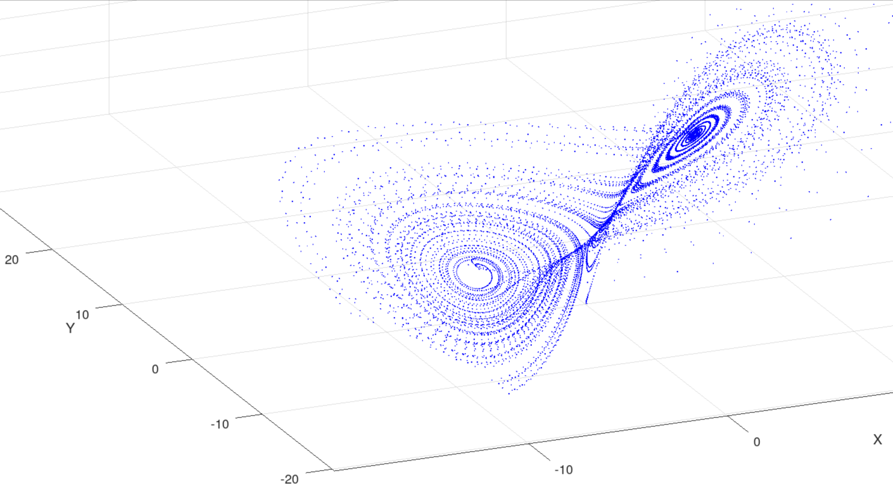

# CHAOS-ENGINE

3D Lorenz attractor simulation via C as an Interface with Fortran as the Engine.
High-performance numerical integration of the chaotic butterfly manifold.
Designed for low-level system efficiency and terminal-centric workflows.

---



---
### Prerequisites
* **Compiler:** `gcc`, `gfortran` (or MinGW for Windows).
* **Visualize:** MATLAB or Octave.

---

### Build & Execute
Compile the Fortran module `engine.f90` as object and link it to `main.c`
```bash
gfortran -c engine.f90
gfortran main.c engine.o
./a.out
```
**Note: Windows may produce `.obj` or `.dll`, kindly modify the compile command according to it**

---

### Visualization
visualize the generated data:

```matlab
% Run in MATLAB/Octave
run('see.m')
```

---

### File Structure
* `engine.f90`: Core computation logic.
* `main.c`: Program entry and execution flow.
* `see.m`: Data visualization script.